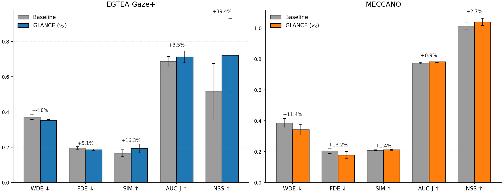
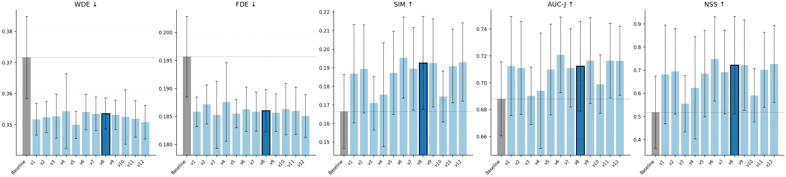
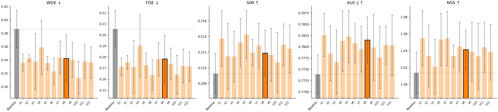

# GLANCE — Gaze-Guided Diffusion for Egocentric Hand-Object Interaction Prediction

> **MEng Individual Project** · Department of Computing, Imperial College London
> Steven Xiang · Supervisor: Dr. Jiankang Deng · Second Marker: Dr. Rolandos Potamias · 2026

GLANCE (**G**aze-**L**ed **A**nticipation of **N**on-autoregressive **C**ontact in **E**gocentric videos) is a multimodal gaze pathway built on top of the Diff-IP2D iterative non-autoregressive diffusion architecture for joint forecasting of future hand trajectories and object affordance hotspots from first-person video. Hardware-tracked human gaze is encoded as continuous 2D Gaussian fixation heatmaps and injected into the backbone as

- a **spatial prior** via sigmoid gating of the object-feature stream inside the Side-Fusion encoder, and
- a **temporal prior** via cross-attention inside each Motion-Aware Denoising Transformer (MADT) block, biased by a learnable eye-hand-latency matrix and gated by zero-init LayerScale.

The architecture is evaluated bidirectionally across two contrasting behavioural regimes — **EGTEA-Gaze+** (free-form cooking, loose eye-hand coupling) and **MECCANO** (instructed industrial assembly, tight coupling) — at a fixed *E = 35*-epoch schedule across five random seeds, with a four-level deterministic scaffold guaranteeing bit-exact intra-GPU reproducibility.

---

## Headline results — 130-cell sweep

Across 13 variants × 5 seeds × 2 datasets (= 130 cells), **every gaze configuration beats Baseline on every metric on both datasets**. GLANCE itself — variant **v8**, the principled cross-dataset default — improves the Baseline by:

| Metric | EGTEA-Gaze+ Δ | MECCANO Δ |
|---|---|---|
| WDE $\downarrow$ | **+4.8 %** (0.372 → 0.354) | **+11.4 %** (0.386 → 0.342) |
| FDE $\downarrow$ | +5.1 % (0.196 → 0.186) | +13.2 % (0.205 → 0.178) |
| SIM $\uparrow$ | +16.3 % (0.166 → 0.193) | +1.4 % (0.209 → 0.212) |
| AUC-J $\uparrow$ | +3.5 % (0.688 → 0.712) | +0.9 % (0.774 → 0.781) |
| NSS $\uparrow$ | **+39.4 %** (0.518 → 0.722) | +2.7 % (1.014 → 1.041) |

<p align="center">
  
</p>

The dataset-conditional **profile inversion** — EGTEA gains concentrate on affordance, MECCANO on trajectory — is real: each dataset's gain expresses itself wherever its ground truth has reachable noise-floor headroom. The full per-variant tables are in §6.

---

## Table of Contents

1. [Setup](#1-setup)
   - [1.1 Conda environment](#11-conda-environment)
   - [1.2 Data download](#12-data-download)
   - [1.3 Repository layout](#13-repository-layout)
2. [Architecture](#2-architecture)
3. [Datasets](#3-datasets)
4. [Reproducing the 130-cell deterministic sweep](#4-reproducing-the-130-cell-deterministic-sweep)
   - [4.1 Variant definitions](#41-variant-definitions)
   - [4.2 Single-cell training and evaluation](#42-single-cell-training-and-evaluation)
   - [4.3 Full 130-cell sweep](#43-full-130-cell-sweep)
   - [4.4 Aggregation across seeds](#44-aggregation-across-seeds)
   - [4.5 Four-level determinism scaffold](#45-four-level-determinism-scaffold)
5. [Inference and deployment](#5-inference-and-deployment)
6. [Per-variant results](#6-per-variant-results)
7. [Citation, acknowledgments, license](#7-citation-acknowledgments-license)

---

## 1. Setup

### 1.1 Conda environment

GLANCE was developed against **Python 3.10**, **PyTorch 2.x**, and **CUDA 12.4**. The exact installation sequence:

```bash
conda create -n glance python=3.10 pip -y
conda activate glance
pip install torch torchvision --index-url https://download.pytorch.org/whl/cu124
pip install "setuptools<70"
pip install visdom torchnet --no-build-isolation
pip install -r requirements.txt
```

The `setuptools<70` pin is required because `torchnet` invokes a deprecated `easy_install`-era hook that was removed in setuptools 70. `--no-build-isolation` is required when installing `torchnet` against the project's pinned setuptools.

**Hardware.** All reported numbers were produced on a single node with 8 × NVIDIA A100-SXM4-80GB. A single training cell at *E* = 35 epochs takes roughly 13 minutes per variant on EGTEA and 17 minutes on MECCANO (warm SIFT-homography cache).

### 1.2 Data download

GLANCE consumes four pre-built tarballs that hold the LMDB feature caches, label pickles, base CNN weights, and EK100-compatible annotations. Download them, then untar into the repository root.

| Tarball | Contents | Download |
|---|---|---|
| `base_models.tar.gz` | Frozen BNInception weights (`model.pth.tar`, ~177 MB) | [Google Drive](https://drive.google.com/file/d/12tP6Zoi9tvAM4Cl13Ci-PG7e_0KHZ6oL/view?usp=drive_link) |
| `CVPR2022-hoi-forecast-training-data.tar.gz` | EK100 training labels and feats from Liu et al. (OCT) | [Google Drive](https://drive.google.com/file/d/1MD6CCmVFNo1ZFflyWCv19GO6uQJ-ktpl/view?usp=drive_link) |
| `data.tar.gz` | EGTEA-Gaze+ and MECCANO feats, labels, eval pickles, `uid2future_*.pickle` | [Google Drive](https://drive.google.com/file/d/1q-bQw60C-EZSnMHjFbHx4ZkKqb6ODfPB/view?usp=drive_link) |
| `common.tar.gz` | EGTEA / MECCANO / EK100 / RULSTM annotation directories | [Google Drive](https://drive.google.com/file/d/1cP-AK82kGR1O6x7FrV4XXfAfMWOf0ofm/view?usp=drive_link) |

A one-liner to fetch and untar (requires [`gdown`](https://github.com/wkentaro/gdown)):

```bash
# in repo root, with conda env activated
pip install gdown
gdown 12tP6Zoi9tvAM4Cl13Ci-PG7e_0KHZ6oL -O base_models.tar.gz
gdown 1MD6CCmVFNo1ZFflyWCv19GO6uQJ-ktpl -O CVPR2022-hoi-forecast-training-data.tar.gz
gdown 1q-bQw60C-EZSnMHjFbHx4ZkKqb6ODfPB -O data.tar.gz
gdown 1cP-AK82kGR1O6x7FrV4XXfAfMWOf0ofm -O common.tar.gz
for f in *.tar.gz; do tar xzf "$f" && rm "$f"; done
```

Total disk footprint after extraction: **~25 GB** (most of it the EGTEA + MECCANO feature LMDBs).

> **Raw frames are *not* required for the 130-cell sweep** — features are pre-extracted into LMDBs. Raw EGTEA / MECCANO video frames are only needed if you re-run the BNInception feature extraction (`scripts/extract_egtea_features.py`, `scripts/extract_meccano_features.py`).

### 1.3 Repository layout

After extracting the tarballs, the layout should be:

```
Diff-IP2D/
├── base_models/
│   └── model.pth.tar                       # frozen BNInception (from base_models.tar.gz)
├── common/                                  # from common.tar.gz
│   ├── egtea-annotations/
│   ├── meccano-annotations/
│   ├── epic-kitchens-100-annotations/
│   └── rulstm/
├── data/                                    # from data.tar.gz
│   ├── egtea/
│   │   ├── feats_train/data.lmdb           # single-LMDB layout
│   │   ├── feats_test/data.lmdb
│   │   ├── labels/
│   │   ├── video_info.json
│   │   └── egtea_eval_labels.pkl
│   ├── meccano/
│   │   ├── feats_train/data.lmdb
│   │   ├── feats_test/data.lmdb            # holds val + test (loader-mode partition)
│   │   ├── labels/
│   │   ├── video_info.json
│   │   └── meccano_eval_labels.pkl
│   ├── ek100/                              # from CVPR2022-hoi-forecast-training-data.tar.gz
│   │   ├── feats_train/                    # two-part split for EK100
│   │   ├── feats_test/
│   │   ├── labels/
│   │   └── ek100_eval_labels.pkl
│   ├── homos_train/                        # auto-cached SIFT homographies (1st epoch)
│   └── homos_test/                         # auto-cached SIFT homographies (1st epoch)
├── uid2future_file_name_egtea.pickle
├── uid2future_file_name_meccano.pickle
├── diffip_weights/                          # auto-created on first training run
├── seed_sweep/                              # auto-created by run_seed_sweep.sh
└── docs/                                    # report + presentation assets
```

The SIFT-homography directories (`data/homos_{train,test}/`) populate themselves automatically during the first training epoch. Subsequent runs read them in milliseconds. Atomic-rename writes plus robust readers protect the cache against the per-worker race that the report flagged in §4.5.1.

---

## 2. Architecture

GLANCE is the inherited Diff-IP2D pipeline extended at exactly **two** structural sites by the gaze pathway.

<p align="center">
  
</p>

The diffusion stack remains: a frozen BNInception backbone produces 1024-D RGB features; an HOI Encoder fans them into global / hand / object streams; a `SideFusionEncoder` merges the streams into a 512-D observation context; a `MotionEncoder` encodes per-pair SIFT homographies; the **MADT** (Motion-Aware Denoising Transformer) iteratively denoises $T_{un}$-step future tokens over $T = 1000$ sqrt-schedule diffusion steps; and per-task heads decode the final latent into 2-D hand coordinates and affordance hotspots.

The three novel modules of GLANCE — added *additively*, with the diffusion loss surface untouched — are:

1. **Dual-stream `GazeEncoder`** (`diffip2d/gaze_modules.py`). Heatmap CNN (32→64→128→256, pool, FC → 512) for spatial inductive bias, combined with a coordinate MLP (3→64→512) for sub-pixel precision. Sum-fused into a 512-D gaze stream $H_{gaze}$. A binary validity flag $v^{(t)}$ masks blinks and tracker dropouts.
2. **`GazeSideFusionEncoder`** (`diffip2d/pre_encoder.py`). Sigmoid-gates the object feature stream:
   $\tilde{H}_{obj}^{(t)} = \sigma(W_g H_{gaze}^{(t)}) \odot H_{obj}^{(t)}$. Suppresses background clutter, amplifies the foveated target.
3. **`GazeTemporalCrossAttention`** in each `DecoderBlock` (`diffip2d/transformer_model.py`). Future-token hand queries cross-attend to past-token gaze keys:
   $\text{XA}_{gaze}(Z_t, H_{gaze}) = \text{softmax}\!\left(\frac{Q K^\top}{\sqrt{d_k}} + B\right) V$
   where $B \in \mathbb{R}^{T_{un} \times T_{obs}}$ is the learnable eye-hand-latency bias matrix. The residual is gated by a zero-init LayerScale parameter $\gamma_{gaze}$, so at $t = 0$ the model is *bit-exactly identical* to the Baseline. At convergence $\gamma_{gaze} \in [0.005,\, 0.05]$ — small but stably non-zero.

**Cost.** +1.74 M parameters, +1.1 ms per training step on an A100 (≈ 3 % overhead vs Baseline's 35 ms step).

---

## 3. Datasets

GLANCE deliberately tests cross-domain transfer across two contrasting eye-hand-coupling regimes.

| | **EGTEA-Gaze+** | **MECCANO** |
|---|---|---|
| Domain | unscripted cooking | instructed industrial assembly |
| Native fps / gaze rate | 30 / 30 Hz | 12 / 200 Hz |
| Hand trajectories | RULSTM-derived continuous points | bbox centroids; ~20% missing → Cubic Hermite |
| Affordance ground truth | detector-derived "select-point" clusters | uniform $K = 5$ samples inside NAO bbox |
| Label window $W_{label}$ | 16 frames | 7 frames |
| Coupling regime | loose, multi-target reach | tight, single-target sequential |
| Test set | 442 (traj) / 69 (aff) | 904 (traj) / 2584 (aff) |
| `--ek_version` | `egtea` | `meccano` |

Both datasets ship synchronised hardware gaze (EGTEA: SMI eye-tracker `.txt` exports; MECCANO: Tobii 200 Hz CSVs, aggregated per-frame by arithmetic mean). The dataloader normalises coordinates to $[0, 1]^2$ relative to capture resolution, then renders a 2D Gaussian heatmap at bandwidth $\sigma = 2.0$ on a $32 \times 32$ grid for the encoder's CNN branch. Missing gaze (blinks, dropouts) is handled by a $\pm 5$-frame nearest-neighbour fallback; if no valid sample is found, $v^{(t)} = 0$ and the heatmap is zero-tensor (the GazeEncoder degrades gracefully).

EK100 inherited from upstream Diff-IP2D is **not used** for the 130-cell sweep — it ships no hardware gaze, so it serves only as a sanity-check loader path. The cross-dataset evaluation in the report uses only EGTEA and MECCANO.

---

## 4. Reproducing the 130-cell deterministic sweep

The headline number for this project is the 130-cell sweep:

$$\text{13 variants} \times \text{5 seeds} \times \text{2 datasets} \;=\; 130 \text{ cells}$$

Each cell trains from scratch for *E* = 35 epochs and runs the trajectory + affordance evaluators. Every (variant, dataset, seed) cell is **bit-exact reproducible** on the same GPU.

### 4.1 Variant definitions

Variants are labelled exactly as in the final report and exactly as in `run_seed_sweep.sh` / `seed_sweep/results.csv`.

| Variant | CLI flags | Design axis exercised |
|---|---|---|
| Baseline | *(no gaze flags)* | Unmodified Diff-IP2D |
| v1 | `--use_gaze` | Full pathway, learnable bias from scratch |
| v2 | `--use_gaze --gaze_coord_only` | Encoder ablation: coord-only MLP |
| v3 | `--use_gaze --gaze_fusion_only` | Fusion-site ablation: gate only |
| v4 | `--use_gaze --gaze_last_n_blocks=2` | Block-coverage: deep XA only |
| v5 | `--use_gaze --gaze_detach_diffusion` | Gradient detach on v1 |
| v6 | `--use_gaze --gaze_fixed_delta=2` | Temporal: hard mask $\Delta = 2$ |
| v7 | `--use_gaze --gaze_bias_init_delta=2 --gaze_bias_init_amp=2.0` | Temporal: Gaussian-init $\Delta = 2,\, A = 2.0$ |
| **v8 (GLANCE)** | `--use_gaze --gaze_bias_init_delta=3 --gaze_bias_init_amp=0.5` | Temporal: Gaussian-init $\Delta = 3,\, A = 0.5$ |
| v9 | *(v8 flags) + `--gaze_heatmap_only`* | Encoder on v8: heatmap-only CNN |
| v10 | *(v8 flags) + `--gaze_cfg_dropout=0.1`* | CFG dropout 10 % on v8 |
| v11 | *(v8 flags) + `--gaze_before_motion`* | Order: gaze XA before egomotion |
| v12 | *(v8 flags) + `--gaze_before_motion --gaze_detach_diffusion`* | Gradient detach on v11 |

All CLI flags are defined in `options/netsopts.py`.

### 4.2 Single-cell training and evaluation

A single (variant, dataset, seed) cell trains, evaluates trajectory, and evaluates affordance in three sequential distributed launches:

```bash
# Example: GLANCE (v8) on EGTEA-Gaze+, seed = 42
DATASET=egtea            # or "meccano"
SEED=42
EPOCHS=35
NUM_CLASSES=106          # 106 for egtea, 61 for meccano
GAZE_FLAGS="--use_gaze --gaze_bias_init_delta=3 --gaze_bias_init_amp=0.5"

# 1. TRAIN
TORCH_DISTRIBUTED_DEBUG=DETAIL python -m torch.distributed.launch \
    --nproc_per_node=8 --master_port=12325 --use_env \
    run_experiment.py \
        --ek_version=$DATASET --epochs=$EPOCHS --batch_size=8 \
        --num_classes=$NUM_CLASSES --seq_len_obs=10 --seq_len_unobs=3 \
        --learnable_weight=True --manual_seed=$SEED \
        $GAZE_FLAGS

# 2. EVAL TRAJECTORY (WDE, FDE)
rm -rf collected_pred_traj
TORCH_DISTRIBUTED_DEBUG=DETAIL python -m torch.distributed.launch \
    --nproc_per_node=8 --master_port=12326 --use_env \
    run_experiment.py \
        --evaluate --traj_only \
        --ek_version=$DATASET --num_classes=$NUM_CLASSES \
        --seq_len_obs=10 --seq_len_unobs=3 \
        --resume=./diffip_weights/checkpoint_${EPOCHS}.pth.tar \
        --manual_seed=$SEED $GAZE_FLAGS

# 3. EVAL AFFORDANCE (SIM, AUC-J, NSS)
rm -rf collected_pred_aff
TORCH_DISTRIBUTED_DEBUG=DETAIL python -m torch.distributed.launch \
    --nproc_per_node=8 --master_port=12327 --use_env \
    run_experiment.py \
        --evaluate \
        --ek_version=$DATASET --num_classes=$NUM_CLASSES \
        --seq_len_obs=10 --seq_len_unobs=3 \
        --resume=./diffip_weights/checkpoint_${EPOCHS}.pth.tar \
        --manual_seed=$SEED $GAZE_FLAGS
```

For a single GPU, set `--nproc_per_node=1` and `--batch_size=64` (global batch size 64 is preserved).

### 4.3 Full 130-cell sweep

The driver script `run_seed_sweep.sh` runs all cells sequentially, skipping any cell with a `.done` marker so the sweep is fully resumable:

```bash
# Roughly 13 + 17 minutes per cell × 130 cells ≈ 65 hours on an 8 × A100 node.
# Use SLURM walltime ≥ 72 hours, or chain with --dependency=afterany.
bash run_seed_sweep.sh
```

The script writes one CSV row per completed cell to `seed_sweep/results.csv` with columns:

```
dataset, variant, seed, epochs, wde, fde, sim, auc_j, nss
```

Per-cell logs land in `seed_sweep/logs/${dataset}_${variant}_seed${seed}.log`; per-cell completion markers in `seed_sweep/markers/`. Deleting a marker re-queues that single cell on the next invocation.

### 4.4 Aggregation across seeds

Once the sweep is complete (or partially complete — aggregation skips cells that haven't finished yet), summarise the per-seed runs into mean ± population standard deviation per (variant, dataset, metric):

```bash
python aggregate_seed_sweep.py summarise --csv seed_sweep/results.csv \
    --out seed_sweep/aggregated.csv
```

The report's substantiveness criterion is applied at analysis time: a delta is treated as substantive only when

$|\Delta| > \max(\sigma_{\text{ref}}, \sigma_{\text{var}})$

over the five seeds $\{13, 42, 256, 777, 2025\}$. The 120 Baseline-vs-gaze deltas (12 variants × 5 metrics × 2 datasets) pass this criterion universally; the within-gaze-family deltas occasionally fall inside the noise floor and are flagged as inconclusive in the report.

### 4.5 Four-level determinism scaffold

Reproducibility is enforced at four orthogonal levels — every level caught at least one real source of variance during development. All four are active by default in `traineval.py`:

1. **PyTorch flags.** `torch.backends.cudnn.deterministic = True`, `torch.backends.cudnn.benchmark = False`, `torch.use_deterministic_algorithms(True)`.
2. **CUBLAS workspace.** The launcher sets `CUBLAS_WORKSPACE_CONFIG=:4096:8`, forcing deterministic GEMM kernel initialisation.
3. **Multi-source seeding.** A single `--manual_seed=$SEED` is propagated to Python `random`, NumPy, PyTorch CPU/CUDA generators, and per-worker DataLoader generators via `worker_init_fn`.
4. **Algorithmic patches in the eval pipeline.** Farthest-Point Sampling for affordance heatmap construction is pinned to `start_idx=0`. AUC-Judd tie-breaking jitter uses `np.random.RandomState(0)`. Both sources of noise had previously masked sub-1 % deltas.

With this scaffold, identical (`--manual_seed`, variant, dataset) tuples produce **bit-exact metric CSV rows** on the same GPU. Cross-hardware reproducibility is *not* guaranteed (CUDA kernel-selection heuristics differ across architectures), but variant *rankings* are stable in our experience.

---

## 5. Inference and deployment

The full 1000-step reverse process takes ≈ 350 ms per clip on a single A100 — too slow for real-time deployment. The reference inference path uses **DDIM respacing** to ~50 steps via `fast_test=True`, which preserves all five metrics **to the third decimal place** on a sub-grid we validated during development:

```bash
python -m torch.distributed.launch --nproc_per_node=1 --master_port=12325 --use_env \
    run_experiment.py \
        --evaluate --ek_version=egtea --num_classes=106 \
        --seq_len_obs=10 --seq_len_unobs=3 \
        --resume=path/to/checkpoint.pth.tar \
        --fast_test=True --use_gaze --gaze_bias_init_delta=3 --gaze_bias_init_amp=0.5
```

With DDIM respacing, inference drops to ≈ 17 ms per clip — comfortably real-time for any 6 fps wearable forecasting loop. The $S = 10$ stochastic samples are independent so they batch into a single forward pass; the gaze encoder adds < 1 ms to the batched pass.

Deployment caveats:
- GLANCE assumes **calibrated hardware gaze** (eye-tracker on the wearable). Estimated-gaze deployment — replacing the sensed signal with a CNN gaze-estimator output — is the natural next step but is *not* validated here.
- DDIM respacing was validated against the full schedule on a sub-grid; cross-checking the full schedule on a new dataset is recommended.

---

## 6. Per-variant results

### EGTEA-Gaze+ (mean ± seed σ across 5 seeds at *E* = 35)

| Variant | WDE $\downarrow$ | FDE $\downarrow$ | SIM $\uparrow$ | AUC-J $\uparrow$ | NSS $\uparrow$ |
|---|---|---|---|---|---|
| Baseline | 0.372 ± 0.013 | 0.196 ± 0.007 | 0.166 ± 0.020 | 0.688 ± 0.028 | 0.518 ± 0.157 |
| v1 | 0.352 ± 0.005 | 0.186 ± 0.003 | 0.187 ± 0.026 | 0.712 ± 0.037 | 0.682 ± 0.213 |
| v2 | 0.352 ± 0.005 | 0.187 ± 0.003 | 0.189 ± 0.024 | 0.711 ± 0.035 | 0.695 ± 0.185 |
| v3 | 0.353 ± 0.007 | **0.185 ± 0.006** | 0.171 ± 0.014 | 0.690 ± 0.021 | 0.555 ± 0.121 |
| v4 | 0.354 ± 0.012 | 0.188 ± 0.007 | 0.176 ± 0.028 | 0.694 ± 0.043 | 0.624 ± 0.221 |
| v5 | **0.350 ± 0.004** | **0.185 ± 0.003** | 0.187 ± 0.022 | 0.710 ± 0.034 | 0.685 ± 0.187 |
| v6 | 0.354 ± 0.006 | 0.186 ± 0.004 | **0.195 ± 0.022** | **0.721 ± 0.028** | **0.749 ± 0.183** |
| v7 | 0.354 ± 0.005 | 0.186 ± 0.003 | 0.189 ± 0.022 | 0.711 ± 0.029 | 0.692 ± 0.181 |
| **v8 (GLANCE)** | 0.354 ± 0.005 | 0.186 ± 0.004 | 0.193 ± 0.025 | 0.712 ± 0.033 | 0.722 ± 0.210 |
| v9 | 0.353 ± 0.005 | 0.186 ± 0.003 | 0.193 ± 0.024 | 0.717 ± 0.032 | 0.722 ± 0.195 |
| v10 | 0.352 ± 0.009 | 0.186 ± 0.005 | 0.175 ± 0.014 | 0.699 ± 0.022 | 0.591 ± 0.115 |
| v11 | 0.352 ± 0.006 | 0.186 ± 0.004 | 0.191 ± 0.020 | 0.717 ± 0.028 | 0.702 ± 0.162 |
| v12 | 0.351 ± 0.005 | **0.185 ± 0.004** | 0.193 ± 0.021 | 0.716 ± 0.026 | 0.727 ± 0.166 |

<p align="center">
  
</p>

### MECCANO (mean ± seed σ across 5 seeds at *E* = 35)

| Variant | WDE $\downarrow$ | FDE $\downarrow$ | SIM $\uparrow$ | AUC-J $\uparrow$ | NSS $\uparrow$ |
|---|---|---|---|---|---|
| Baseline | 0.386 ± 0.028 | 0.205 ± 0.017 | 0.209 ± 0.003 | 0.774 ± 0.004 | 1.014 ± 0.025 |
| v1 | 0.336 ± 0.013 | 0.171 ± 0.008 | **0.214 ± 0.004** | **0.783 ± 0.005** | **1.055 ± 0.033** |
| v2 | 0.342 ± 0.005 | 0.175 ± 0.006 | 0.211 ± 0.004 | 0.779 ± 0.006 | 1.034 ± 0.037 |
| v3 | 0.338 ± 0.042 | 0.171 ± 0.024 | 0.211 ± 0.003 | 0.777 ± 0.007 | 1.021 ± 0.032 |
| v4 | 0.359 ± 0.040 | 0.190 ± 0.028 | 0.213 ± 0.003 | 0.781 ± 0.007 | 1.053 ± 0.031 |
| v5 | 0.335 ± 0.010 | 0.173 ± 0.011 | **0.214 ± 0.003** | 0.782 ± 0.006 | 1.054 ± 0.032 |
| v6 | 0.323 ± 0.020 | **0.164 ± 0.014** | 0.212 ± 0.002 | 0.781 ± 0.004 | 1.034 ± 0.013 |
| v7 | 0.344 ± 0.024 | 0.178 ± 0.015 | 0.213 ± 0.003 | 0.779 ± 0.005 | 1.045 ± 0.028 |
| **v8 (GLANCE)** | 0.342 ± 0.035 | 0.178 ± 0.021 | 0.212 ± 0.003 | 0.781 ± 0.005 | 1.041 ± 0.023 |
| v9 | 0.340 ± 0.026 | 0.174 ± 0.014 | 0.212 ± 0.003 | 0.780 ± 0.007 | 1.039 ± 0.035 |
| v10 | **0.313 ± 0.024** | **0.164 ± 0.018** | 0.211 ± 0.004 | 0.778 ± 0.007 | 1.033 ± 0.040 |
| v11 | 0.338 ± 0.025 | 0.172 ± 0.015 | 0.213 ± 0.003 | 0.780 ± 0.004 | 1.044 ± 0.030 |
| v12 | 0.336 ± 0.023 | 0.171 ± 0.013 | 0.212 ± 0.003 | 0.780 ± 0.007 | 1.038 ± 0.033 |

<p align="center">
  
</p>

### Best-of-suite (winning variant per metric)

| Metric | EGTEA best | MECCANO best |
|---|---|---|
| WDE $\downarrow$ | +5.9 % (v5) | **+18.9 %** (v10) |
| FDE $\downarrow$ | +5.6 % (v3 / v5 / v12) | +20.2 % (v6 / v10) |
| SIM $\uparrow$ | +17.5 % (v6) | +2.4 % (v1 / v5) |
| AUC-J $\uparrow$ | +4.8 % (v6) | +1.1 % (v1) |
| NSS $\uparrow$ | **+44.6 %** (v6) | +4.1 % (v1) |

The four substantive findings from the cross-dataset comparison:

1. **Gaze is a universally positive prior.** 12/12 variants × 5/5 metrics × 2/2 datasets above Baseline — 120 substantive deltas, zero false positives.
2. **The gain profile inverts.** EGTEA peaks on affordance (+39–45 % NSS), MECCANO peaks on trajectory (+11–19 % WDE). Each dataset's gain expresses itself wherever its ground truth has reachable headroom.
3. **Fusion topology dominates stabilisation.** Gate + cross-attention together carry both spatial and temporal contributions; gradient detachment and attention re-ordering are seed-noise-neutral.
4. **Some axes are dataset-conditional.** Hard mask wins EGTEA affordance; CFG dropout wins MECCANO trajectory but costs ΔNSS = −0.131 on EGTEA. GLANCE (v8) is the principled cross-dataset default.

---

## 7. Citation, acknowledgments, license

If you use GLANCE, please cite the upstream Diff-IP2D paper (the inherited backbone) and the present project:

```bibtex
@inproceedings{ma2025diff,
  title        = {Diff-ip2d: Diffusion-based hand-object interaction prediction on egocentric videos},
  author       = {Ma, Junyi and Chen, Xieyuanli and Xu, Jingyi and Wang, Hesheng},
  booktitle    = {2025 IEEE/RSJ International Conference on Intelligent Robots and Systems (IROS)},
  pages        = {4291--4298},
  year         = {2025},
  organization = {IEEE}
}

@misc{xiang2026glance,
  title   = {GLANCE: Gaze-Guided Diffusion for Egocentric Hand-Object Interaction Prediction},
  author  = {Xiang, Qi},
  year    = {2026},
  note    = {MEng Individual Project, Imperial College London},
  url     = {https://github.com/Steven-XQ/GLANCE}
}
```

Please also cite the source datasets and the architectural ancestors:

- **EGTEA-Gaze+** — Li et al., *In the eye of beholder: joint learning of gaze and actions in first person video*, ECCV 2018.
- **MECCANO** — Ragusa et al., *The MECCANO dataset: understanding human-object interactions from egocentric videos in an industrial-like domain*, WACV 2021.
- **OCT (baseline architecture)** — Liu et al., *Joint hand motion and interaction hotspots prediction from egocentric videos*, CVPR 2022.
- **RULSTM (label lineage)** — Furnari & Farinella, *Rolling-unrolling LSTMs for action anticipation from first-person video*, TPAMI 2020.
- **EPIC-Kitchens-100** — Damen et al., *Rescaling egocentric vision*, IJCV 2022.

This repository inherits from and modifies the [Diff-IP2D](https://github.com/IRMVLab/Diff-IP2D) source release. The original Diff-IP2D code is released under the terms of its upstream license; this fork preserves the upstream license. The new code added by this project (the gaze pathway in `diffip2d/gaze_modules.py`, the MECCANO and EGTEA adapters in `datasets/`, the deterministic sweep harness in `run_seed_sweep.sh` and `aggregate_seed_sweep.py`, and the data preparation scripts under `scripts/`) is released under the MIT License.
